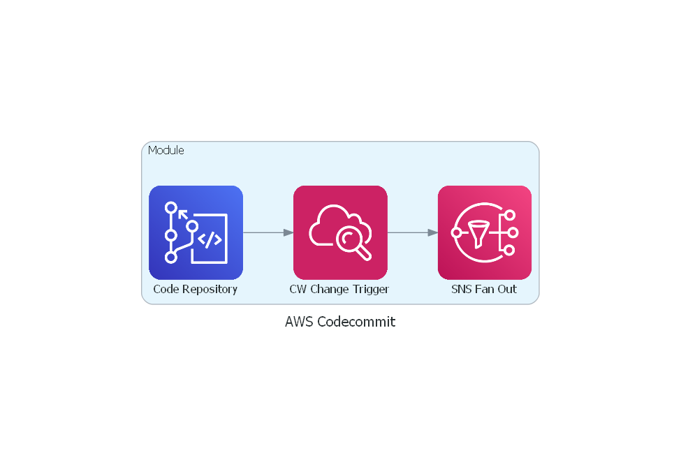

# terraform-aws-codecommit

[](https://github.com/JamesWoolfenden/terraform-aws-codecommit)
[](https://github.com/JamesWoolfenden/terraform-aws-codecommit/releases/latest)
[](https://github.com/JamesWoolfenden/terraform-aws-codecommit/releases/latest)

[](https://www.bridgecrew.cloud/link/badge?vcs=github&fullRepo=JamesWoolfenden%2Fterraform-aws-codecommit&benchmark=CIS+AWS+V1.2)
[](https://github.com/pre-commit/pre-commit)
[](https://www.checkov.io/)
[](https://www.bridgecrew.cloud/link/badge?vcs=github&fullRepo=JamesWoolfenden%2Fterraform-aws-codecommit&benchmark=INFRASTRUCTURE+SECURITY)

Terraform module to provision an AWS [`Codecommit`](https://aws.amazon.com/codecommit/) as part of a CI/CD system, includes SNS and triggers. It also includes a policy and group to restrict/branch protect the master branch.

---

It's 100% Open Source and licensed under the [APACHE2](LICENSE).

## Usage



Include this repository as a module in your existing Terraform code:

```hcl
module "codecommit" {
  source          = "JamesWoolfenden/codecommit/aws"
  version         = "v0.3.0"
  default_branch  = var.default_branch
  repository_name = var.repository_name
  developer_group = var.developer_group
}
```

## Costs

```md
✔ Calculating monthly cost estimate

Project: .

Name Monthly Qty Unit Monthly Cost

module.codecommit.aws_sns_topic.notification
└─ Requests Cost depends on usage: $0.50 per 1M requests

PROJECT TOTAL $0.00
```

<!-- BEGINNING OF PRE-COMMIT-TERRAFORM DOCS HOOK -->
## Requirements

No requirements.

## Providers

| Name | Version |
|------|---------|
| <a name="provider_aws"></a> [aws](#provider\_aws) | n/a |

## Modules

No modules.

## Resources

| Name | Type |
|------|------|
| [aws_cloudwatch_event_rule.eventrule](https://registry.terraform.io/providers/hashicorp/aws/latest/docs/resources/cloudwatch_event_rule) | resource |
| [aws_cloudwatch_event_target.target](https://registry.terraform.io/providers/hashicorp/aws/latest/docs/resources/cloudwatch_event_target) | resource |
| [aws_codecommit_approval_rule_template.example](https://registry.terraform.io/providers/hashicorp/aws/latest/docs/resources/codecommit_approval_rule_template) | resource |
| [aws_codecommit_approval_rule_template_association.link](https://registry.terraform.io/providers/hashicorp/aws/latest/docs/resources/codecommit_approval_rule_template_association) | resource |
| [aws_codecommit_repository.repo](https://registry.terraform.io/providers/hashicorp/aws/latest/docs/resources/codecommit_repository) | resource |
| [aws_iam_group_policy_attachment.restrict-attach](https://registry.terraform.io/providers/hashicorp/aws/latest/docs/resources/iam_group_policy_attachment) | resource |
| [aws_iam_policy.restrictmaster](https://registry.terraform.io/providers/hashicorp/aws/latest/docs/resources/iam_policy) | resource |
| [aws_sns_topic.notification](https://registry.terraform.io/providers/hashicorp/aws/latest/docs/resources/sns_topic) | resource |
| [aws_sns_topic_policy.default](https://registry.terraform.io/providers/hashicorp/aws/latest/docs/resources/sns_topic_policy) | resource |
| [aws_caller_identity.current](https://registry.terraform.io/providers/hashicorp/aws/latest/docs/data-sources/caller_identity) | data source |
| [aws_iam_policy_document.restrictmaster](https://registry.terraform.io/providers/hashicorp/aws/latest/docs/data-sources/iam_policy_document) | data source |
| [aws_iam_policy_document.sns_topic_policy](https://registry.terraform.io/providers/hashicorp/aws/latest/docs/data-sources/iam_policy_document) | data source |

## Inputs

| Name | Description | Type | Default | Required |
|------|-------------|------|---------|:--------:|
| <a name="input_approver_role"></a> [approver\_role](#input\_approver\_role) | ARN of approver role | `string` | n/a | yes |
| <a name="input_default_branch"></a> [default\_branch](#input\_default\_branch) | The name of the default repository branch | `string` | `"master"` | no |
| <a name="input_developer_group"></a> [developer\_group](#input\_developer\_group) | An existing Iam Group to attach the policy permissions to | `string` | `""` | no |
| <a name="input_kms_master_key_id"></a> [kms\_master\_key\_id](#input\_kms\_master\_key\_id) | The kms key to use | `string` | n/a | yes |
| <a name="input_repository_name"></a> [repository\_name](#input\_repository\_name) | The name of your GIT repository | `string` | n/a | yes |
| <a name="input_template"></a> [template](#input\_template) | n/a | `map` | <pre>{<br>  "approvers": 2,<br>  "description": "This is an example approval rule template",<br>  "name": "MyExampleApprovalRuleTemplate"<br>}</pre> | no |

## Outputs

| Name | Description |
|------|-------------|
| <a name="output_clone_url_https"></a> [clone\_url\_https](#output\_clone\_url\_https) | n/a |
| <a name="output_clone_url_ssh"></a> [clone\_url\_ssh](#output\_clone\_url\_ssh) | n/a |
<!-- END OF PRE-COMMIT-TERRAFORM DOCS HOOK -->

## Policy Requirement

<!-- BEGINNING OF PRE-COMMIT-PIKE DOCS HOOK -->
The Policy required is:

```json
{
    "Version": "2012-10-17",
    "Statement": [
        {
            "Sid": "VisualEditor0",
            "Effect": "Allow",
            "Action": [
                "SNS:CreateTopic",
                "SNS:DeleteTopic",
                "SNS:GetTopicAttributes",
                "SNS:ListTagsForResource",
                "SNS:SetTopicAttributes"
            ],
            "Resource": "*"
        },
        {
            "Sid": "VisualEditor1",
            "Effect": "Allow",
            "Action": [
                "codecommit:CreateRepository",
                "codecommit:DeleteRepository",
                "codecommit:GetRepository",
                "codecommit:ListBranches",
                "codecommit:ListTagsForResource",
                "codecommit:UpdateRepositoryDescription"
            ],
            "Resource": "*"
        },
        {
            "Sid": "VisualEditor2",
            "Effect": "Allow",
            "Action": [
                "events:DeleteRule",
                "events:DescribeRule",
                "events:ListTagsForResource",
                "events:ListTargetsByRule",
                "events:PutRule",
                "events:PutTargets",
                "events:RemoveTargets"
            ],
            "Resource": "*"
        },
        {
            "Sid": "VisualEditor3",
            "Effect": "Allow",
            "Action": [
                "iam:AttachGroupPolicy",
                "iam:CreateGroup",
                "iam:CreatePolicy",
                "iam:DeleteGroup",
                "iam:DeletePolicy",
                "iam:DetachGroupPolicy",
                "iam:GetGroup",
                "iam:GetPolicy",
                "iam:GetPolicyVersion",
                "iam:ListAttachedGroupPolicies",
                "iam:ListPolicyVersions"
            ],
            "Resource": "*"
        },
        {
            "Sid": "VisualEditor4",
            "Effect": "Allow",
            "Action": [
                "kms:CreateKey",
                "kms:DescribeKey",
                "kms:EnableKeyRotation",
                "kms:GetKeyPolicy",
                "kms:GetKeyRotationStatus",
                "kms:ListResourceTags",
                "kms:ScheduleKeyDeletion"
            ],
            "Resource": "*"
        }
    ]
}

```
<!-- END OF PRE-COMMIT-PIKE DOCS HOOK -->


## Instructions

This modules creates a repo with direct updates to the master denied. Its has been a common DevOps process pattern to use the mainline model or trunk-based development <https://paulhammant.com/2013/04/05/what-is-trunk-based-development/,> however it is with experience that the optimal pattern is of short lived single activity feature branches, YMMV.

To use this repository the expected behaviour is to branch when starting a new piece of work, for example.

`git pull`

`git branch -b feature/JGW-121-Remove-Project-Managers`

Do your work, check-in.
Push to your feature branch.

`git push -u origin feature/JGW-121-Remove-Project-Managers`

Then when your done create a PR and request the merge.

## Details

Creates a group called developer, to which the policy is attached.
To use the repo you need to add the your users to that group.

## Using Codecommit

To use codecommit you need to set some git config properties for the credential helper:

`git config --global credential.helper '!aws codecommit credential-helper $@'`

`git config --global credential.UseHttpPath true`

And for SSH look at: <https://docs.aws.amazon.com/codecommit/latest/userguide/setting-up-ssh-unixes.html>

Use ssh-keygen and create a key in your home folder called codecommit

`publickey=$(<~/.ssh/codecommit.pub)`

`user=$(aws iam get-user --query 'User.UserName' --output text)`

### On Windows

`$publickey=get-content ~/.ssh/codecommit.pub`

`$user=aws iam get-user --query 'User.UserName'`

On both:
`aws iam upload-ssh-public-key --user-name $user --ssh-public-key-body $publickey`

Get your ssh key id from the previous commands output

`SSHPublicKeyId=$(aws iam list-ssh-public-keys --user-name $user --query 'SSHPublicKeys[*].SSHPublicKeyId' --output text)`

OR

`$SSHPublicKeyId=(aws iam list-ssh-public-keys --user-name $user --query 'SSHPublicKeys[*].SSHPublicKeyId')|convertfrom-json`

Update your config file with:

$gitconfigupdate=@"
Host git-codecommit.\*.amazonaws.com
User $SSHPublicKeyId
IdentityFile ~/.ssh/codecommit
"@
Add-content ~/.ssh/config \$gitconfigupdate

### linux

cat << EOF > ~/.ssh/config
Host git-codecommit.\*.amazonaws.com
User \$SSHPublicKeyId
IdentityFile ~/.ssh/codecommit
EOF

eval \$(ssh-agent -s)
ssh-add codecommit

Test with:
`ssh git-codecommit.us-east-2.amazonaws.com`

## Related Projects

Check out these related projects.

- [terraform-aws-codebuild](https://github.com/jameswoolfenden/terraform-aws-codebuild) - Making a Build pipeline

## Help

**Got a question?**

File a GitHub [issue](https://github.com/jameswoolfenden/terraform-aws-codecommit/issues).

## Contributing

### Bug Reports & Feature Requests

Please use the [issue tracker](https://github.com/jameswoolfenden/terraform-aws-codecommit/issues) to report any bugs or file feature requests.

## Copyrights

Copyright © 2019-2022 James Woolfenden

## License

[](https://opensource.org/licenses/Apache-2.0)

See [LICENSE](LICENSE) for full details.

Licensed to the Apache Software Foundation (ASF) under one
or more contributor license agreements. See the NOTICE file
distributed with this work for additional information
regarding copyright ownership. The ASF licenses this file
to you under the Apache License, Version 2.0 (the
"License"); you may not use this file except in compliance
with the License. You may obtain a copy of the License at

<https://www.apache.org/licenses/LICENSE-2.0>

Unless required by applicable law or agreed to in writing,
software distributed under the License is distributed on an
"AS IS" BASIS, WITHOUT WARRANTIES OR CONDITIONS OF ANY
KIND, either express or implied. See the License for the
specific language governing permissions and limitations
under the License.

### Contributors

[![James Woolfenden][jameswoolfenden_avatar]][jameswoolfenden_homepage]<br/>[James Woolfenden][jameswoolfenden_homepage]

[jameswoolfenden_homepage]: https://github.com/jameswoolfenden
[jameswoolfenden_avatar]: https://github.com/jameswoolfenden.png?size=150
